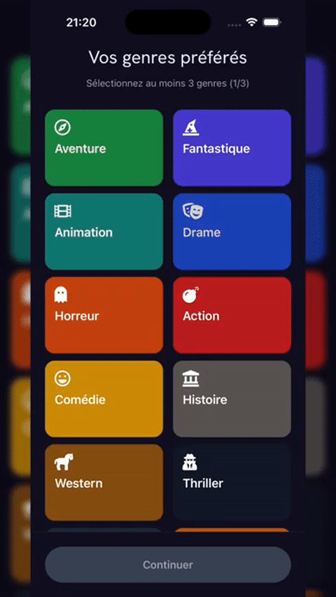

# Dexia — Offline Movie Recommender

<p align="center">
  
</p>

<p align="center">
  Mobile movie recommendation application built with <strong>React Native</strong>, <strong>TypeScript</strong>, <strong>Expo</strong> and <strong>SQLite</strong>.
</p>

<p align="center">
  Dexia runs primarily from a local movie database and adapts recommendations from user interactions, combining targeted suggestions with deliberate discovery to avoid repetitive recommendations.
</p>

---

## Preview

### Favorite genres selection

<p align="center">
  
</p>

The onboarding flow lets users select their preferred genres before the recommendation engine starts adapting to their interactions.

### Swipe-based recommendation experience

<p align="center">
  
</p>

The main discovery flow uses swipe interactions to collect feedback and progressively refine recommendations.

### Demo video

A longer walkthrough of the project is available on YouTube:

[Watch the video demo](https://www.youtube.com/watch?v=xhrPfPFlkgo)

---

## Overview

Dexia was designed around a simple idea:

> movie recommendations should become more relevant over time without requiring the application to depend on a remote recommendation service.

The application stores movie data, profiles, preferences and interactions locally with SQLite.

Users can:

- create and select profiles
- choose initial favourite genres
- discover films through a swipe interface
- like or dislike recommendations
- maintain a watchlist
- receive recommendations that evolve with their interactions
- use the core recommendation experience offline

---

## Recommendation Strategy

The recommendation engine combines two complementary strategies:

```text
User preferences + interaction history
                ↓
        ┌───────┴────────┐
        │                │
        ▼                ▼
 Targeted movies    Discovery movies
      70%                30%
        │                │
        └───────┬────────┘
                ▼
         Shuffled results
```

For a batch of 10 recommendations:

- **7 targeted recommendations** are selected from user preferences
- **3 discovery recommendations** deliberately come from outside the preferred genres

This 70/30 split keeps recommendations personalized while preserving some exploration.

---

## Targeted Recommendations

The targeted path uses:

- preferred genres
- dynamic keywords
- preferred actors
- interaction history
- movie ratings
- popularity

Already-seen films are excluded directly in the SQL query.

The recommendation service also performs filtering and scoring inside SQLite instead of loading the full catalogue into memory.

A simplified view of the targeted query is:

```text
Preferred genres
      +
Dynamic keywords
      +
Preferred actors
      +
Movie quality / popularity
      -
Already seen films
      ↓
Targeted candidates
```

This keeps the recommendation logic compatible with an offline-first mobile architecture.

---

## Discovery Recommendations

A purely preference-based recommender can quickly become repetitive.

Dexia therefore reserves part of every recommendation batch for films outside the user's preferred genres.

The discovery query:

- excludes previously seen films
- excludes films matching the main preferred genres
- ranks the remaining catalogue using quality and popularity signals

This creates controlled exploration rather than fully random recommendations.

---

## Adaptive Preferences

User interactions progressively update the recommendation profile.

The application stores and uses several signals:

### Genre weights

Genres evolve according to user feedback.

Likes strengthen related genre preferences, while dislikes reduce their weight.

### Dynamic keywords

Keywords extracted from liked content can be used as an additional preference signal.

This gives the engine more context than genre selection alone.

### Preferred actors

Actor preferences can also contribute to targeted recommendation scoring.

### Interaction history

The recommendation service excludes films the user has already interacted with, reducing repeated suggestions.

---

## Local-First Architecture

The application's core data flow is local:

```text
React Native UI
      ↓
Application screens
      ↓
Models / Services
      ↓
RecommendationService
      ↓
Expo SQLite
      ↓
Local movie database
```

The bundled SQLite database contains the movie catalogue used by the application.

User preferences and interactions are also stored locally.

This architecture provides several advantages:

- core recommendations do not require a remote recommendation server
- low-latency access to movie and preference data
- offline usage
- user interaction data remains on the device for the core experience
- SQL can be used directly for filtering and ranking

---

## Architecture

```text
dexia-movie-recommender/
├── app/
│   ├── _layout.tsx
│   ├── index.tsx
│   ├── welcomeScreen.tsx
│   ├── onBoarding.tsx
│   ├── favorite-genres.tsx
│   ├── profile-create.tsx
│   ├── profile-selection.tsx
│   ├── homeScreen.tsx
│   ├── swipe.tsx
│   ├── settings.tsx
│   ├── help.tsx
│   └── privacy.tsx
│
├── src/
│   ├── models/
│   │   ├── db.ts
│   │   ├── user.ts
│   │   ├── movies.ts
│   │   ├── interaction.ts
│   │   └── cast.ts
│   │
│   ├── services/
│   │   └── RecommendationService.ts
│   │
│   └── ...
│
├── assets/
│   ├── database.db
│   ├── icon.png
│   └── readme/
│       ├── favorite-genres.gif
│       └── swipe-demo-v2.gif
│
├── backend/
│   ├── database.db
│   └── db.sql
│
├── package.json
└── README.md
```

---

## Main Screens

### Onboarding

The onboarding flow establishes the user's initial preferences before the recommendation engine begins adapting from interactions.

### Home

The home screen exposes personalized content and entry points to the main discovery features.

### Swipe discovery

The swipe interface provides the main recommendation loop:

```text
Recommendation
     ↓
Like / Dislike
     ↓
Interaction stored locally
     ↓
Preferences evolve
     ↓
Next recommendation batch
```

### Profiles

The project includes profile creation and profile selection screens so recommendation data can be separated between different local profiles.

### Watchlist

Users can save films for later through locally stored interactions.

---

## SQLite Data Model

The local database contains several entities used by the application.

### `movies`

Stores movie information such as:

- ID
- title
- overview
- release date
- average rating
- popularity
- poster path

### `genres`

Stores available movie genres.

### `movie_genres`

Associates movies with genres.

### `user_profile`

Stores profile-specific recommendation information such as:

- profile name
- initial preferences
- dynamic keywords
- genre weights
- language
- onboarding state

### `user_interactions`

Stores interactions between a profile and a movie:

- `view`
- `like`
- `dislike`
- `favorite`
- `watchlist`

### Cast data

Movie/cast relationships are used to support actor-aware recommendation signals.

---

## Database Evolution

The application includes lightweight SQLite migrations.

At startup, the database layer checks the schema and can add missing profile fields such as:

- dynamic keywords
- genre weights
- language
- profile name

Database initialization is also protected by a shared initialization promise to reduce race conditions when several parts of the application request the database at the same time.

---

## Query Optimisation

The recommendation engine performs much of its filtering directly in SQL.

Examples include:

- excluding seen movie IDs with `NOT IN`
- filtering by genre through `movie_genres`
- filtering descriptions using selected keywords
- joining cast data only when actor preferences are available
- applying `LIMIT` at query level
- launching targeted and discovery queries in parallel

This avoids unnecessary full-catalogue processing in JavaScript and keeps the mobile recommendation flow more responsive.

---

## Tech Stack

### Mobile

- React Native
- Expo
- Expo Router
- TypeScript

### Data

- Expo SQLite
- SQL
- Local bundled database

### UI

- NativeWind
- React Native Reanimated
- React Native Gesture Handler
- React Native SVG

### Application concepts

- offline-first data access
- adaptive recommendation logic
- interaction-based personalization
- multi-profile local state
- SQL-based filtering and scoring

---

## Installation

### Requirements

- Node.js 18+
- npm
- Expo-compatible Android/iOS environment or Expo Go

Clone the repository:

```bash
git clone https://github.com/Lasryy/dexia-movie-recommender.git
cd dexia-movie-recommender
```

Install dependencies:

```bash
npm install
```

Start Expo:

```bash
npm start
```

To clear the Expo cache:

```bash
npm run start:clean
```

You can also start directly for a target platform:

```bash
npm run android
```

or:

```bash
npm run ios
```

---

## Local Database

A SQLite database is bundled with the project:

```text
assets/database.db
```

The application ensures that the database is available locally before opening it with Expo SQLite.

Schema migrations are then applied when necessary.

---

## Team Project

Dexia was developed as a collaborative university project.

This repository is my fork of the original team repository:

[Maxime-Lointier/Dexia](https://github.com/Maxime-Lointier/Dexia)

The fork is kept on this profile to present the project while preserving its collaborative origin.

---

## Academic Context

University project focused on advanced application development.

The project combines:

- mobile development
- local relational data
- recommendation logic
- adaptive user preferences
- application architecture
- offline-first constraints

---

## What This Project Demonstrates

Dexia showcases experience with:

- React Native and TypeScript
- mobile application architecture
- SQLite data modelling
- SQL query optimisation
- recommendation-system design
- adaptive preference modelling
- offline-first application development
- local persistence
- collaborative software development

---

<details>
<summary><strong>🇫🇷 Version française</strong></summary>

<br>

# Dexia — Recommandation de films hors ligne

<p align="center">
  
</p>

Application mobile de recommandation de films développée avec **React Native**, **TypeScript**, **Expo** et **SQLite**.

Dexia fonctionne principalement à partir d'une base de films locale et adapte progressivement ses recommandations aux interactions de l'utilisateur, tout en conservant une part volontaire de découverte.

---

## Aperçu

### Sélection des genres préférés

<p align="center">
  
</p>

L'onboarding permet à l'utilisateur de sélectionner ses genres préférés avant que le moteur de recommandation commence à s'adapter à ses interactions.

### Expérience de recommandation par swipe

<p align="center">
  
</p>

La découverte principale repose sur une interface de swipe permettant de collecter les retours de l'utilisateur et d'affiner progressivement les recommandations.

### Vidéo de démonstration

Une présentation plus longue du projet est disponible sur YouTube :

[Voir la vidéo de démonstration](https://www.youtube.com/watch?v=xhrPfPFlkgo)

---

## Présentation

Dexia repose sur une idée simple :

> proposer des recommandations qui deviennent plus pertinentes au fil de l'utilisation sans dépendre d'un serveur distant pour le moteur principal de recommandation.

L'application conserve localement les films, les profils, les préférences et les interactions grâce à SQLite.

Les utilisateurs peuvent notamment :

- créer et sélectionner plusieurs profils
- choisir leurs genres préférés lors de l'onboarding
- découvrir des films via une interface de swipe
- liker ou disliker les recommandations
- maintenir une watchlist
- obtenir des recommandations évoluant selon leurs interactions
- utiliser le cœur de l'expérience de recommandation hors ligne

---

## Stratégie de recommandation

Le moteur combine deux approches complémentaires :

```text
Préférences + historique d'interactions
                ↓
        ┌───────┴────────┐
        │                │
        ▼                ▼
 Recommandations      Découverte
      ciblées
       70 %               30 %
        │                │
        └───────┬────────┘
                ▼
         Mélange final
```

Pour un lot de 10 films :

- **7 recommandations ciblées** utilisent les préférences du profil
- **3 recommandations de découverte** sortent volontairement des genres préférés

Cette répartition 70/30 permet de personnaliser les résultats sans enfermer l'utilisateur dans les mêmes catégories.

---

## Recommandations ciblées

La sélection ciblée utilise notamment :

- les genres préférés
- les mots-clés dynamiques
- les acteurs préférés
- l'historique des interactions
- la note des films
- leur popularité

Les films déjà vus sont exclus directement dans les requêtes SQL.

Le service de recommandation effectue aussi une partie importante du filtrage et du scoring dans SQLite plutôt que de charger l'intégralité du catalogue en mémoire.

Schéma simplifié :

```text
Genres préférés
      +
Mots-clés dynamiques
      +
Acteurs préférés
      +
Qualité / popularité
      -
Films déjà vus
      ↓
Candidats ciblés
```

---

## Découverte

Un moteur exclusivement centré sur les préférences existantes devient rapidement répétitif.

Dexia réserve donc une partie des recommandations à des films situés en dehors des genres favoris.

La requête de découverte :

- exclut les films déjà vus
- écarte les principaux genres préférés
- classe les films restants selon des signaux de qualité et de popularité

La découverte reste ainsi contrôlée plutôt que totalement aléatoire.

---

## Préférences adaptatives

Les interactions font progressivement évoluer le profil de recommandation.

### Poids des genres

Les genres évoluent selon les retours de l'utilisateur.

Les likes renforcent les genres associés et les dislikes peuvent réduire leur poids.

### Mots-clés dynamiques

Des mots-clés issus des contenus appréciés peuvent être utilisés comme signal supplémentaire.

Le moteur ne dépend donc pas uniquement des catégories de films.

### Acteurs préférés

Les préférences liées aux acteurs peuvent également intervenir dans le scoring des recommandations ciblées.

### Historique

Les films ayant déjà fait l'objet d'une interaction sont exclus des prochaines sélections afin de limiter les répétitions.

---

## Architecture local-first

Le cœur du flux de données reste local :

```text
Interface React Native
        ↓
Écrans de l'application
        ↓
Models / Services
        ↓
RecommendationService
        ↓
Expo SQLite
        ↓
Base de films locale
```

La base SQLite embarquée contient le catalogue utilisé par l'application.

Les préférences et interactions des profils sont également conservées localement.

Cette architecture permet notamment :

- de faire fonctionner le cœur des recommandations sans serveur distant
- d'obtenir des accès rapides aux données
- d'utiliser l'application hors ligne
- de conserver localement les interactions pour l'expérience principale
- d'utiliser directement SQL pour le filtrage et le classement

---

## Architecture du projet

```text
dexia-movie-recommender/
├── app/
│   ├── _layout.tsx
│   ├── index.tsx
│   ├── welcomeScreen.tsx
│   ├── onBoarding.tsx
│   ├── favorite-genres.tsx
│   ├── profile-create.tsx
│   ├── profile-selection.tsx
│   ├── homeScreen.tsx
│   ├── swipe.tsx
│   ├── settings.tsx
│   ├── help.tsx
│   └── privacy.tsx
│
├── src/
│   ├── models/
│   │   ├── db.ts
│   │   ├── user.ts
│   │   ├── movies.ts
│   │   ├── interaction.ts
│   │   └── cast.ts
│   │
│   ├── services/
│   │   └── RecommendationService.ts
│   │
│   └── ...
│
├── assets/
│   ├── database.db
│   ├── icon.png
│   └── readme/
│       ├── favorite-genres.gif
│       └── swipe-demo-v2.gif
│
├── backend/
│   ├── database.db
│   └── db.sql
│
├── package.json
└── README.md
```

---

## Écrans principaux

### Onboarding

Le parcours initial établit les premières préférences avant que les interactions ne commencent à faire évoluer le moteur.

### Accueil

L'écran d'accueil présente du contenu personnalisé et permet d'accéder aux principales fonctionnalités de découverte.

### Swipe

Le swipe constitue la boucle principale :

```text
Recommandation
      ↓
Like / Dislike
      ↓
Interaction stockée localement
      ↓
Évolution des préférences
      ↓
Nouveau lot de recommandations
```

### Profils

Le projet comprend des écrans de création et de sélection de profils afin de séparer les préférences et interactions de plusieurs utilisateurs locaux.

### Watchlist

Les films à voir plus tard sont enregistrés sous forme d'interactions locales.

---

## Modèle de données SQLite

### `movies`

Contient notamment :

- identifiant
- titre
- synopsis
- date de sortie
- note moyenne
- popularité
- chemin de l'affiche

### `genres`

Liste les genres disponibles.

### `movie_genres`

Associe les films à leurs genres.

### `user_profile`

Stocke les informations de recommandation propres à chaque profil :

- nom du profil
- préférences initiales
- mots-clés dynamiques
- poids des genres
- langue
- état de l'onboarding

### `user_interactions`

Conserve les interactions entre un profil et un film :

- `view`
- `like`
- `dislike`
- `favorite`
- `watchlist`

### Casting

Les relations films/casting peuvent être exploitées comme signal supplémentaire dans les recommandations.

---

## Évolution de la base

L'application intègre de petites migrations SQLite.

Au démarrage, la couche base de données vérifie le schéma et peut ajouter certains champs manquants, notamment :

- mots-clés dynamiques
- poids des genres
- langue
- nom du profil

L'initialisation de la base est également protégée par une promesse partagée pour réduire les risques de race condition lorsque plusieurs composants demandent simultanément l'accès aux données.

---

## Optimisation des requêtes

Le moteur effectue une partie importante du filtrage directement en SQL.

Par exemple :

- exclusion des films déjà vus avec `NOT IN`
- filtrage par genres via `movie_genres`
- filtrage de synopsis selon certains mots-clés
- jointure avec le casting seulement lorsque nécessaire
- limitation des résultats directement en SQL
- lancement parallèle des requêtes ciblées et découverte

Cela évite de parcourir inutilement tout le catalogue côté JavaScript.

---

## Stack technique

### Mobile

- React Native
- Expo
- Expo Router
- TypeScript

### Données

- Expo SQLite
- SQL
- Base locale embarquée

### Interface

- NativeWind
- React Native Reanimated
- React Native Gesture Handler
- React Native SVG

### Concepts

- architecture offline-first
- logique de recommandation adaptative
- personnalisation par interactions
- profils locaux multiples
- filtrage et scoring SQL

---

## Installation

### Prérequis

- Node.js 18+
- npm
- environnement Android/iOS compatible Expo ou Expo Go

Cloner le dépôt :

```bash
git clone https://github.com/Lasryy/dexia-movie-recommender.git
cd dexia-movie-recommender
```

Installer les dépendances :

```bash
npm install
```

Lancer Expo :

```bash
npm start
```

Pour vider le cache Expo :

```bash
npm run start:clean
```

Lancement Android :

```bash
npm run android
```

Lancement iOS :

```bash
npm run ios
```

---

## Base locale

Une base SQLite est embarquée dans :

```text
assets/database.db
```

L'application s'assure que cette base est disponible localement avant de l'ouvrir avec Expo SQLite.

Les migrations nécessaires sont ensuite appliquées.

---

## Projet en équipe

Dexia a été développé dans le cadre d'un projet universitaire collectif.

Le dépôt présent sur ce profil est mon fork du dépôt d'équipe original :

[Maxime-Lointier/Dexia](https://github.com/Maxime-Lointier/Dexia)

Le fork permet de présenter le projet sur mon profil tout en conservant clairement son origine collaborative.

---

## Contexte académique

Projet universitaire orienté développement avancé d'application.

Il combine notamment :

- développement mobile
- données relationnelles locales
- moteur de recommandation
- adaptation des préférences
- architecture applicative
- contraintes offline-first

---

## Ce que ce projet démontre

Dexia met notamment en avant des compétences en :

- React Native et TypeScript
- architecture d'application mobile
- modélisation SQLite
- optimisation de requêtes SQL
- conception d'un système de recommandation
- modélisation de préférences adaptatives
- développement offline-first
- persistance locale
- développement logiciel en équipe

</details>
